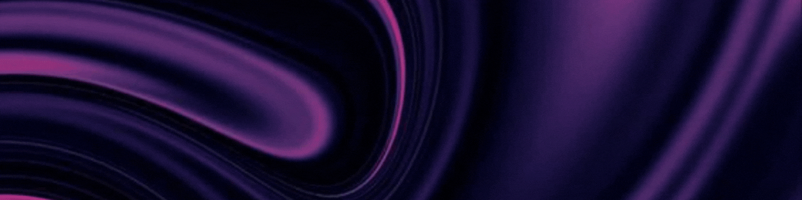

<!--  -->

 

Olá, atualmente estou cursando bacharelado em Engenharia de Software na instituição de ensino FIAP!
Tive meu primeiro contato com a programação através do Técnico de Informática para Internet na Etec Anhanguera, no qual estudei sobre lógica de programação, banco de dados, desenvolvimento web e aprendi algumas linguagens e ferramentas como: PHP, Mysql, HTML, CSS, Wordpress, Bootstrap. 

###  Find me on 

### Skills

## Stats

 

<!--  -->

<!--
-->

<!--<picture>
  <source media="(prefers-color-scheme: dark)" srcset="https://raw.githubusercontent.com/camfeitosa/camfeitosa/output/github-snake-dark.svg" />
  <source media="(prefers-color-scheme: light)" srcset="https://raw.githubusercontent.com/camfeitosa/camfeitosa/output/github-snake.svg" />
  
</picture> -->

  

<!-- 

# 📊 GitHub Stats:
 
 

 -->

<picture>
  <source media="(prefers-color-scheme: dark)" srcset="https://raw.githubusercontent.com/camfeitosa/camfeitosa/output/pacman-contribution-graph-dark.svg">
  <source media="(prefers-color-scheme: light)" srcset="https://raw.githubusercontent.com/camfeitosa/camfeitosa/output/pacman-contribution-graph.svg">
  
</picture>

###
